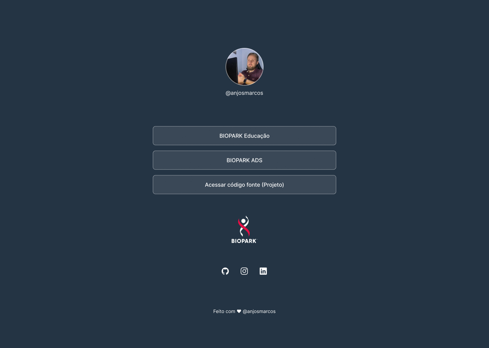

<h1 align="center"> CloneLinks </h1>

Programa foi desenvolvido para ser apresentado para uma aula experimental sobre Front-end no BioPark

  

## 🚀 Tecnologias

Esse projeto foi desenvolvido com as seguintes tecnologias:

- HTML
- CSS

## 💻 Projeto

O CloneLinks é um agregador de links para usar como cartão de visitas online.

- [Acesse o projeto finalizado, online](https://anjosmarcos.github.io/CloneLink/)

## 📃 Apresentação 

- [Acesse documentação da aula, online](/document/Aula%20Experimental_%20Front-end%20.pdf)

## 📄 Licença

Esse projeto está sob a licença MIT.